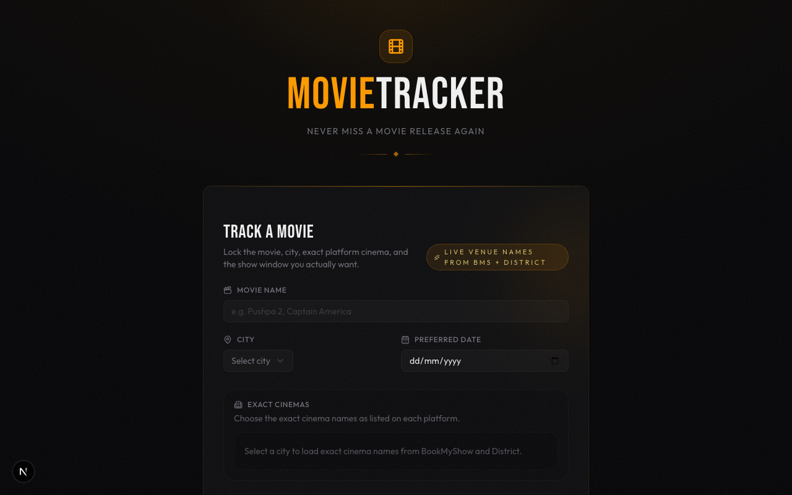
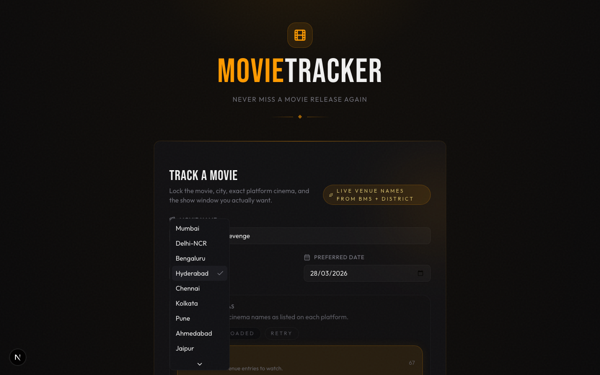
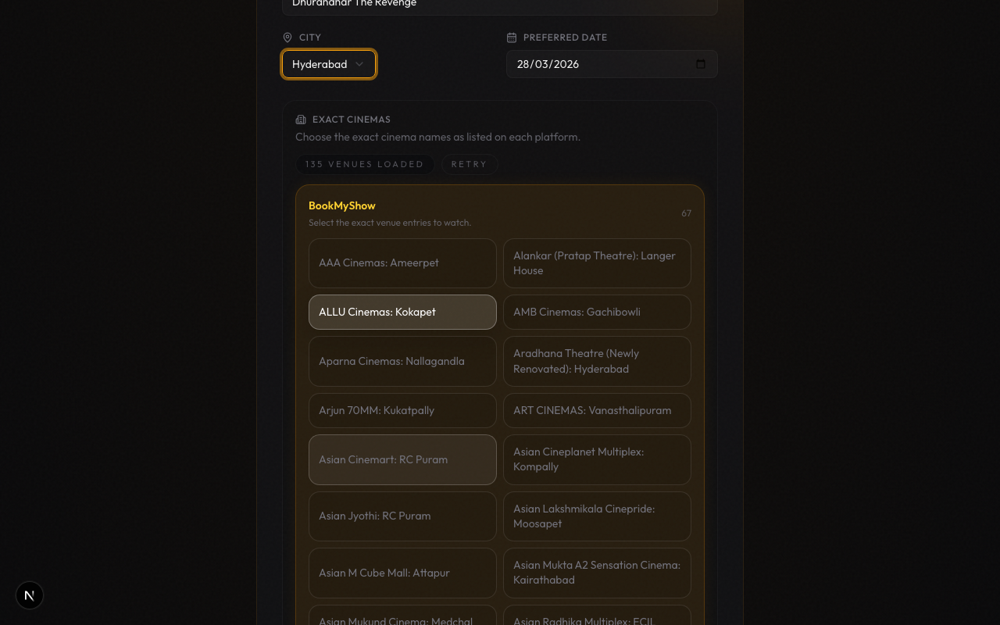
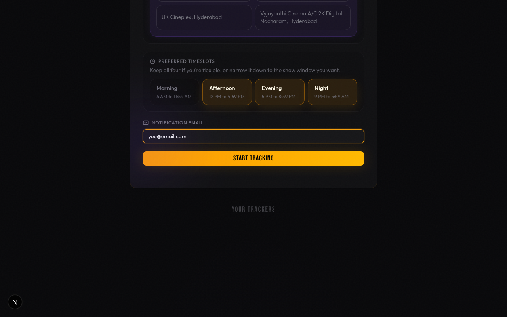
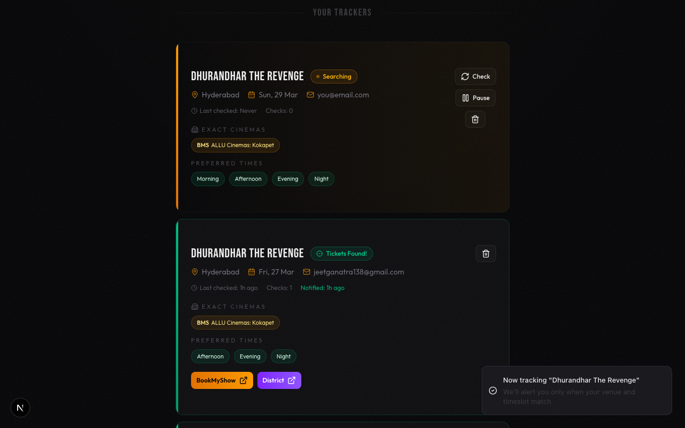
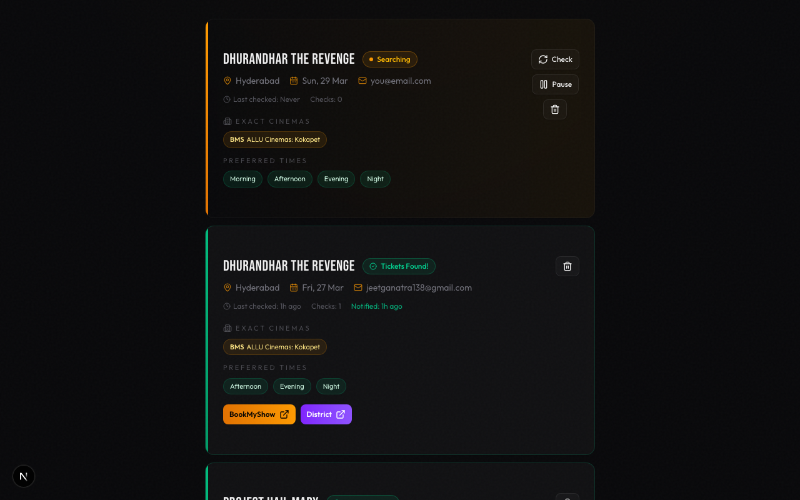
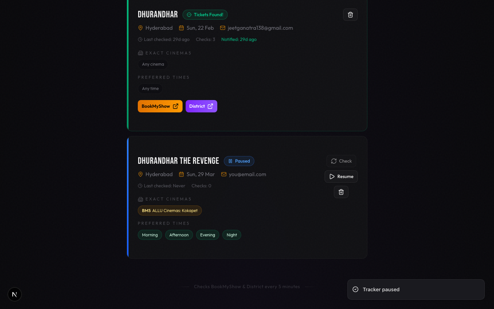
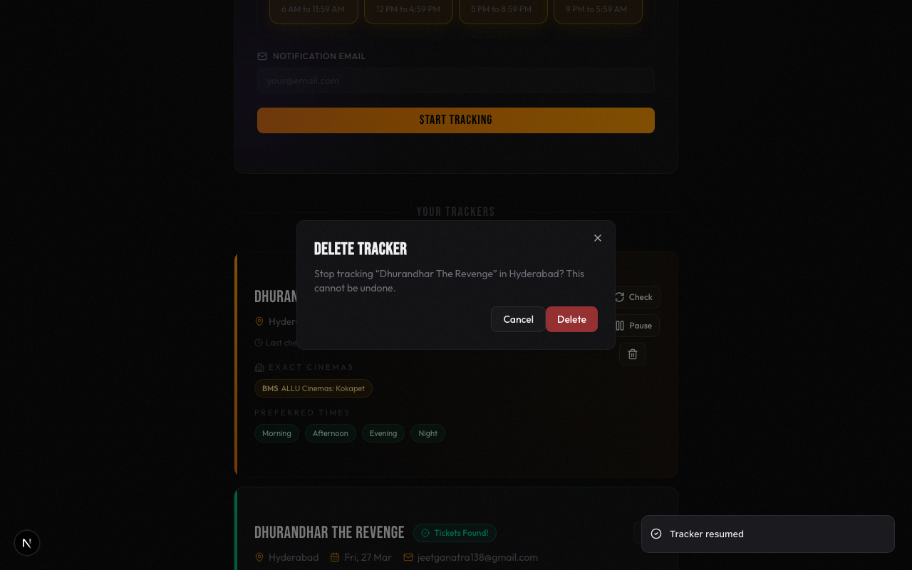
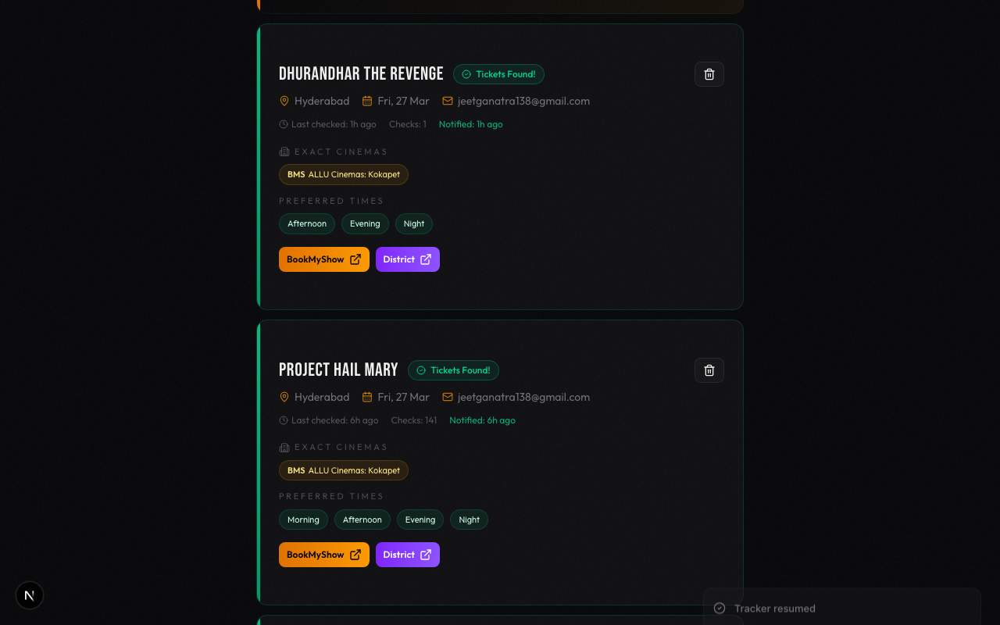

# MovieTracker

> **Note:** This entire app was solely vibecoded using [Claude](https://claude.ai) and [Codex](https://openai.com/index/introducing-codex/). No manual code was written — every line of code, every scraper, every UI component was generated through AI pair programming.

MovieTracker is a local-first movie ticket availability tracker for India. It scrapes **BookMyShow** and **District** on a schedule and emails you when matching shows appear for your exact cinema and time preferences.

This is not a generic movie database app. It is a scraper-backed alerting tool aimed at catching ticket openings for specific movie/date/cinema combinations.

---

# Part 1: Usage Guide

## What It Does

- Track any movie across **14 Indian cities**
- Select **exact cinemas** from live venue lists scraped from BookMyShow and District
- Choose **preferred time windows**: Morning, Afternoon, Evening, Night
- Get **email notifications** the moment matching tickets open
- **Pause, resume, manually check**, or delete trackers from the UI
- Runs checks every few minutes automatically via a built-in cron scheduler

## Screenshots

### Home Page
The main interface with the tracker form and your active trackers below.



### City Selection
Choose from 14 supported cities — Mumbai, Delhi-NCR, Bengaluru, Hyderabad, Chennai, Kolkata, Pune, Ahmedabad, Jaipur, Lucknow, Chandigarh, Kochi, Goa, Indore.



### Cinema Selection
After selecting a city, the app scrapes both BookMyShow and District to load real cinema names. Select the exact venues you want to track — here showing 135 venues loaded for Hyderabad.



### Timeslots & Submit
Pick your preferred show windows and enter your email for notifications.



### Active Trackers
Once submitted, trackers appear below the form. Each card shows the movie, city, date, cinemas, timeslots, and live status. An active tracker has **Check** (trigger on-demand), **Pause**, and **Delete** buttons.



### Tracker Actions
Use **Check** to trigger an on-demand scrape, **Pause** to temporarily stop automatic checks, or the trash icon to delete.



### Paused Tracker
A paused tracker shows a blue "Paused" badge and a **Resume** button. Automatic cron checks skip paused trackers.



### Delete Confirmation
Deleting a tracker shows a confirmation dialog to prevent accidental removal.



### Tickets Found
When tickets are detected, the card turns green with a "Tickets Found!" badge and shows direct **BookMyShow** and **District** booking links.



---

## Setup

### Prerequisites

- **Node.js 20+** and npm
- **Google Chrome installed locally** (recommended — the BookMyShow scraper uses system Chrome to bypass Cloudflare bot detection)
- **A Gmail account** with an App Password (see below)
- **A Google Cloud OAuth client** for local Google sign-in

### Step 1: Clone and install

```bash
git clone https://github.com/jeetganatra/movie-tickets-tracker.git
cd movie-tickets-tracker
npm install
```

If Playwright browsers are missing, install them:

```bash
npx playwright install chromium
```

### Step 2: Configure environment variables

```bash
cp .env.example .env.local
```

Edit `.env.local` with your values:

```env
GMAIL_USER=your-email@gmail.com
GMAIL_KEYCHAIN_SERVICE=MovieTracker-Gmail-App-Password
AUTH_GOOGLE_ID=your-google-oauth-client-id
AUTH_KEYCHAIN_ACCOUNT=movie-tickets-tracker
AUTH_SECRET_KEYCHAIN_SERVICE=MovieTracker-Auth-Secret
AUTH_GOOGLE_SECRET_KEYCHAIN_SERVICE=MovieTracker-Google-OAuth-Secret
# Optional. Leave unset to allow any verified Google account to sign in locally.
# ALLOWED_GOOGLE_EMAILS=you@gmail.com,friend@gmail.com
CRON_SECRET=any-random-string-you-choose
DATABASE_URL=./data/movietracker.db
CHECK_INTERVAL_MINUTES=5
NEXT_PUBLIC_APP_URL=http://localhost:3000
```

### Step 3: Configure Google Login

1. Create or select a project in [Google Cloud Console](https://console.cloud.google.com/).
2. Configure the OAuth consent screen. For broad local use, choose an
   **External** audience. If the app stays in testing mode, add each Google
   account under test users; to let any Google account use the client, publish
   the OAuth app.
3. Create an OAuth client with application type **Web application**.
4. Add this authorized redirect URI:

```text
http://localhost:3000/api/auth/callback/google
```

5. Put the client ID in `AUTH_GOOGLE_ID` in `.env.local`.
6. Store the authentication secrets in macOS Keychain:

```bash
npm run auth:setup
```

The setup command generates the Auth.js session secret and securely prompts for
the Google OAuth client secret. Neither secret is written to the project or
shell history. By default, any verified Google account can sign in locally, and
each account gets its own private trackers. To lock a local install down to
specific accounts, set `ALLOWED_GOOGLE_EMAILS` to a comma-separated allowlist.

### Step 4: Setting Up Gmail Credentials

MovieTracker uses Gmail to send email notifications when tickets are found. You need to create a **Gmail App Password** (your regular Gmail password will not work).

#### 4a. Enable 2-Step Verification

1. Go to [Google Account Security](https://myaccount.google.com/security)
2. Under "How you sign in to Google", click **2-Step Verification**
3. Follow the prompts to enable it (if not already enabled)

#### 4b. Generate an App Password

1. Go to [App Passwords](https://myaccount.google.com/apppasswords)
   - If you don't see this option, make sure 2-Step Verification is enabled first
2. Enter a name like `MovieTracker`
3. Click **Create**
4. Google will show you a **16-character password** (e.g., `abcd efgh ijkl mnop`)
5. Copy this password — you won't be able to see it again

#### 4c. Store the App Password in macOS Keychain

Keep only the Gmail address and Keychain service name in `.env.local`:

```env
GMAIL_USER=your-email@gmail.com
GMAIL_KEYCHAIN_SERVICE=MovieTracker-Gmail-App-Password
```

Then run this command. It prompts securely for the App Password and does not
place it in shell history:

```bash
security add-generic-password -U \
  -a "your-email@gmail.com" \
  -s "MovieTracker-Gmail-App-Password" \
  -w
```

The app reads the password from Keychain when it sends an alert. For non-macOS
deployments, `GMAIL_APP_PASSWORD` is still supported as a fallback environment
variable.

### Step 5: Start the app

```bash
npm run dev
```

This starts both the Next.js dev server and the cron scheduler. Open [http://localhost:3000](http://localhost:3000).

---

## How to Use

### Creating a Tracker

1. **Movie Name** — Enter the exact movie name as it appears on BookMyShow (e.g., "Pushpa 2", "Drishyam 3")
2. **City** — Select from the dropdown. This loads live cinema names from both platforms.
3. **Preferred Date** — Pick the date you want to watch (must be today or later)
4. **Exact Cinemas** — Wait for cinemas to load (~10-25 seconds), then select one or more venues. Cinemas are tagged by platform (BookMyShow / District).
5. **Preferred Timeslots** — Select one or more: Morning (6AM-12PM), Afternoon (12PM-5PM), Evening (5PM-9PM), Night (9PM-6AM).
6. Click **START TRACKING**. Alerts go to the verified signed-in Google email.

### Managing Trackers

- **Check Now** — Manually trigger a check for a specific tracker
- **Pause / Resume** — Temporarily stop or restart checking
- **Delete** — Remove a tracker and all its check history
- The tracker list auto-refreshes every 30 seconds

### How Notifications Work

- The cron scheduler checks all active trackers every `CHECK_INTERVAL_MINUTES` (default: 5)
- When matching shows are found, you get **one email** with all available showtimes
- After a successful notification, the tracker status changes to `found` and stops checking
- If the email fails to send, the tracker stays active and retries next cycle

---

## Available npm Scripts

| Command | What it does |
|---|---|
| `npm run dev` | Starts Next.js server + cron scheduler together |
| `npm run dev:web` | Starts only the Next.js server |
| `npm run dev:cron` | Starts only the cron scheduler |
| `npm run build` | Builds the Next.js app for production |
| `npm run start` | Starts production server + cron together |
| `npm run lint` | Runs ESLint |

---

## Troubleshooting

### Cinema list doesn't load

- Make sure Google Chrome is installed on your machine
- Run `npx playwright install chromium` if you haven't already
- BookMyShow may be temporarily blocking — try again in a few minutes

### No emails are being sent

- Verify `GMAIL_USER` and `GMAIL_APP_PASSWORD` in `.env.local`
- Make sure you're using an **App Password**, not your regular Gmail password
- Check that 2-Step Verification is enabled on your Google account
- Look at the terminal logs for email errors

### Manual BookMyShow test

Test the scraper directly from the command line:

```bash
node --import tsx scripts/run-bms-check.ts "Movie Name" hyderabad 2026-03-27
```

---
---

# Part 2: Architecture & Design

> This section covers the internal design of MovieTracker for developers who want to understand or extend the codebase.

## Tech Stack

| Layer | Technology |
|---|---|
| Framework | Next.js 16 (App Router) |
| UI | React 19, Tailwind CSS 4, shadcn/ui, Radix UI |
| State | SWR (30s polling), React hooks |
| Database | SQLite via better-sqlite3 + Drizzle ORM |
| Scraping | Playwright (system Chrome + bundled Chromium) |
| Scheduling | node-cron (standalone process) |
| Email | Nodemailer (Gmail SMTP) |
| Language | TypeScript (strict mode) |

## Architecture Overview

```
┌──────────────────────────────────────────────────────────────────────────┐
│                         MovieTracker Architecture                        │
├──────────────────────────────────────────────────────────────────────────┤
│                                                                          │
│  ┌─────────────────┐     HTTP      ┌─────────────────────────────────┐  │
│  │   Frontend       │ ──────────▶  │   API Routes (Next.js)          │  │
│  │                  │              │                                  │  │
│  │  page.tsx (SPA)  │  ◀──────────  │  /api/cities                   │  │
│  │  tracker-form    │     JSON     │  /api/cinemas                   │  │
│  │  tracker-list    │              │  /api/trackers    /api/check    │  │
│  │  tracker-card    │              │  /api/trackers/[id]             │  │
│  │                  │              │  /api/cron  ◀─── Cron Runner    │  │
│  │  shadcn/ui       │              │                                  │  │
│  │  Sonner toasts   │              │  tracker-check.ts (orchestrator)│  │
│  │  SWR polling     │              │  preferences.ts (filter logic)  │  │
│  └─────────────────┘              └────────┬──────────┬──────────────┘  │
│                                            │          │                  │
│                                     ┌──────┘          └──────┐          │
│                                     ▼                        ▼          │
│                           ┌─────────────────┐    ┌──────────────────┐   │
│                           │    SQLite DB     │    │   Scrapers       │   │
│                           │                  │    │                  │   │
│                           │  trackers        │    │  BookMyShow      │   │
│                           │  check_results   │    │  (system Chrome) │   │
│                           │                  │    │                  │   │
│                           │  Drizzle ORM     │    │  District        │   │
│                           │  WAL mode        │    │  (Chromium)      │   │
│                           └─────────────────┘    └────────┬─────────┘   │
│                                                           │              │
│  ┌─────────────────┐                              ┌───────┴──────────┐  │
│  │  Cron Scheduler  │  ──── GET /api/cron ────▶   │  External Sites  │  │
│  │  node-cron       │  every N minutes             │  bookmyshow.com  │  │
│  │  start-cron.ts   │                              │  district.in     │  │
│  └─────────────────┘                              └──────────────────┘  │
│                                                                          │
│  ┌─────────────────┐                                                    │
│  │  Email Service   │  ◀── triggered when tickets found                 │
│  │  Nodemailer      │                                                    │
│  │  Gmail SMTP      │  ──▶ HTML email with showtimes + booking links    │
│  └─────────────────┘                                                    │
│                                                                          │
└──────────────────────────────────────────────────────────────────────────┘
```

## Data Flow

### Creating a Tracker

```
User fills form
    │
    ▼
Select city ──▶ GET /api/cinemas ──▶ Playwright scrapes BMS + District
    │                                       │
    ▼                                       ▼
Select cinemas ◀──────────────────── Returns cinema list (30-min cache)
    │
    ▼
Submit ──▶ POST /api/trackers ──▶ Validate & store in SQLite
    │
    ▼
Tracker appears in list (SWR auto-refresh)
```

### Checking for Tickets

```
Cron fires (every N min)
    │
    ▼
GET /api/cron (Bearer auth)
    │
    ▼
Load active trackers (max 20 per cycle)
    │
    ├──▶ BMS Scraper ──▶ Navigate to movie page ──▶ Extract showtimes
    │
    ├──▶ District Scraper ──▶ Navigate to movie page ──▶ Extract showtimes
    │
    ▼
Apply preference filters (cinema + timeslot matching)
    │
    ├── No match ──▶ Store result, continue checking
    │
    └── Match found ──▶ Build HTML email
                            │
                            ▼
                       Send via Gmail
                            │
                            ├── Success ──▶ Status = "found", set notifiedAt
                            └── Failure ──▶ Stay active, retry next cycle
```

## Directory Structure

```
src/
├── app/
│   ├── page.tsx                    # Main SPA page
│   ├── layout.tsx                  # Root layout (fonts, theme, toasts)
│   ├── globals.css                 # Tailwind styles
│   └── api/
│       ├── cities/route.ts         # GET — supported cities
│       ├── cinemas/route.ts        # GET — scrape cinema names for a city
│       ├── trackers/route.ts       # GET/POST — list and create trackers
│       ├── trackers/[id]/route.ts  # GET/PATCH/DELETE — single tracker ops
│       ├── check/route.ts          # POST — manual check for one tracker
│       └── cron/route.ts           # GET — scheduled batch check
│
├── components/
│   ├── tracker-form.tsx            # Create tracker form with cinema loading
│   ├── tracker-list.tsx            # Auto-refreshing tracker list (SWR)
│   ├── tracker-card.tsx            # Tracker card with actions
│   ├── header.tsx                  # App header/branding
│   ├── empty-state.tsx             # Empty state UI
│   ├── status-badge.tsx            # Color-coded status badge
│   └── ui/                         # shadcn/ui primitives (11 components)
│
├── lib/
│   ├── cities.ts                   # City config (14 cities, BMS/District slugs)
│   ├── cinemas.ts                  # Cinema scraper + 30-min in-memory cache
│   ├── preferences.ts              # Timeslot/cinema filtering logic
│   ├── tracker-check.ts            # Orchestrates parallel BMS + District checks
│   ├── utils.ts                    # Utility functions
│   ├── db/
│   │   ├── index.ts                # SQLite init (WAL mode, foreign keys)
│   │   └── schema.ts              # Drizzle schema (trackers, check_results)
│   ├── email/
│   │   ├── sender.ts               # Gmail transport via Nodemailer
│   │   └── templates.ts            # HTML email template for notifications
│   └── scrapers/
│       ├── types.ts                # ShowInfo, ShowtimeResult types
│       ├── browser.ts              # Playwright context (stealth + regular)
│       ├── bookmyshow.ts           # BMS scraper (~1000 lines)
│       └── district.ts             # District scraper (~340 lines)
│
└── types/
    └── index.ts                    # TypeScript interfaces

scripts/
├── start-cron.ts                   # Standalone cron process runner
├── run-bms-check.ts                # CLI helper for testing BMS scraper
└── inspect-bms-*.ts                # Debugging scripts for BMS selectors
```

## Database Schema

Two tables managed by Drizzle ORM:

### `trackers`

| Column | Type | Description |
|---|---|---|
| `id` | TEXT (PK) | UUID |
| `movieName` | TEXT | Movie name to search for |
| `city` | TEXT | Display city name |
| `preferredDate` | TEXT | YYYY-MM-DD |
| `email` | TEXT | Notification email |
| `status` | TEXT | `active` / `found` / `expired` / `paused` / `error` |
| `bmsRegionCode` | TEXT | BMS region code (e.g., "MUMBAI") |
| `bmsSlug` | TEXT | BMS URL slug (e.g., "mumbai") |
| `districtCitySlug` | TEXT | District URL slug (e.g., "delhi-ncr") |
| `preferredCinemas` | TEXT | JSON array of `CinemaSelection` |
| `preferredTimeslots` | TEXT | JSON array of timeslot strings |
| `lastCheckedAt` | TEXT | Last check timestamp |
| `checkCount` | INTEGER | Number of checks performed |
| `notifiedAt` | TEXT | When email was sent (null = not yet notified) |
| `createdAt` | TEXT | Creation timestamp |
| `updatedAt` | TEXT | Last update timestamp |

### `check_results`

| Column | Type | Description |
|---|---|---|
| `id` | TEXT (PK) | UUID |
| `trackerId` | TEXT (FK) | References trackers.id (cascade delete) |
| `platform` | TEXT | `bookmyshow` or `district` |
| `found` | INTEGER | 1 = tickets found, 0 = not found |
| `rawData` | TEXT | JSON stringified ShowInfo[] |
| `errorMessage` | TEXT | Error message if scraping failed |
| `checkedAt` | TEXT | Check timestamp |

## Scraper Design

### BookMyShow Scraper

The BMS scraper is the most complex part (~1000 lines). Key design decisions:

1. **System Chrome first** — Uses `channel: "chrome"` in Playwright to launch the user's installed Chrome, which bypasses Cloudflare bot detection. Falls back to bundled Chromium with stealth flags if Chrome is unavailable.

2. **Stealth context** — `createStealthContext()` in `browser.ts` adds anti-automation flags, hides `navigator.webdriver`, rotates User-Agent strings, and sets Indian locale/timezone.

3. **DOM extraction** — BMS uses a ReactVirtualized grid. The scraper finds theaters via `<a href*="cinemas">` links and showtimes via regex matching on leaf `<div>` elements.

4. **Format detection** — Automatically detects DOLBY, IMAX, ATMOS, 4DX, and other premium formats from page text.

5. **Retry logic** — Falls back to search-based movie finding if direct URL navigation fails.

### District Scraper

Simpler (~340 lines). Uses bundled Chromium (no Cloudflare issues). Has three extraction strategies with a fallback chain:
1. Cinema links (`<a href*="/CD">`)
2. `<li>` element text parsing
3. Full body text pattern matching

### Timeslot Mapping

| Timeslot | Hours |
|---|---|
| Morning | 6:00 AM – 11:59 AM |
| Afternoon | 12:00 PM – 4:59 PM |
| Evening | 5:00 PM – 8:59 PM |
| Night | 9:00 PM – 5:59 AM |

## Cron System

The cron runner (`scripts/start-cron.ts`) is a standalone Node.js process that:

1. Reads `.env.local` manually (it's not a Next.js process)
2. Uses `node-cron` to schedule calls every `CHECK_INTERVAL_MINUTES`
3. Calls `GET /api/cron` with Bearer auth
4. The API handles all logic — the cron process is just a trigger

**Limits:** Max 20 trackers per cycle, 3-second delay between trackers.

## Caveats

1. **`DATABASE_URL` is ignored** — The database path is hardcoded to `data/movietracker.db` in `src/lib/db/index.ts`.

2. **`.env.local` is the only reliable env file** — The cron process reads `.env.local` directly. Other env files may work for Next.js but not for the cron runner.

3. **BookMyShow blocking** — Cloudflare may block the scraper even with system Chrome. The code logs these failures explicitly.

4. **Cinema selection is required** — You must select at least one cinema. There is no "any cinema in the city" mode.

5. **First-hit notifications only** — Each tracker sends at most one email. After that, it becomes `found` and stops checking. If email fails, it retries next cycle.

6. **20 tracker limit per cron cycle** — To prevent resource exhaustion, the cron endpoint processes at most 20 active trackers per run.

---

*Built with AI, for movie lovers who refuse to miss opening day.*
